<h1> Elementary</h1>
<h2>An Ontology to Model Electro-mechanical Systems and their Functioning</h2>
(Written in a casual manner by a casual human)


[TOC]

## What is this about?

Electro-mechanical systems in are inter-connected components that process substance, effort, and energy in a coordinated manner. This could be anything ranging from a humble electric kettle to a power plant. Traditionally, descriptions of such systems, usually diagrams and texts, have been created to solely cater for human understanding (yes, I will come to LLMs). Quite often such artifacts of knowledge may be incorrect or incomplete, which in most cases, needs to be compensated by the engineering skills of the reader. With the age of AI-assisted autonomy dawning on the industry, the question arises as to how we can make this knowledge accessible to also _intelligent artificial agents_. Or, should we just let such agents (including language agents) _discover_ the system on their own and _learn_ to control it? The latter option sounds attractive because it is almost engineering-free. Except we all know that it is riddled with lack of accuracy, reliability, safety, and explainability. Instead of being forced to choose between heavily engineered (and purely reactive) software programs and creative agents based on language/vision models, I advocate a middle path of making expert-created knowledge encoded in a _machine-understandable_ manner available to both logically reasoning and generative agents. Of course, curation of such knowledge is not so obvious, and where possible, it is often expensive. Which is why I show that even basic qualitative descriptions that can be automatically synthesized out of existing sources bring significant benefit to AI agents which are then spared of creatively probabilistic acts. I am quite sure that the astounding capabilities of current day LLMs is on your mind. I will take time to show that I am not talking of knowledge-informed approach as being _disjoint_ from or versus AI methods, but contrarily, that it can be a very integral part of AI (and this is currently missing).

**Elementary** is an ontology that helps model such knowledge for AI. It is based on the Semantic Web standards which has a proven record in supporting industrial applications. The name Elementary is inspired by Conan Doyle's fictional character of Sherlock Holmes, who impresses upon his friend Watson that events and observations can be explained on the basis of _elementary_ facts (the phrase first appears in the story "A study in Scarlet"). In "The Adventure of the Blue Carbuncle", Holmes deduces a stranger’s entire personality, financial status, and lifestyle just by looking at a lost, battered felt hat. When it comes to the physical world in which machines operate, elementary facts are indeed invaluable in working out what often looks mysterious.

I claim (on good grounds) that the knowledge we need has to include at least four aspects: (1) Requirements, i.e., what needs to be accomplished, (2) system design description, i.e., what was built to accomplish the goals, (3) physical principles (underlying the system), and (4) the description of how the system's function is automated towards achieving the requirements. I am talking about knowledge required to automate / operate the system and not design and build it. I found most people nodding in agreement to 1, 2, and 4, and generally frowning on mention of 3. But it turns out that physics is the easiest of all and it makes other things even more easier.

Therefore, in principle, knowledge modeled by Elementary consists of four parts:

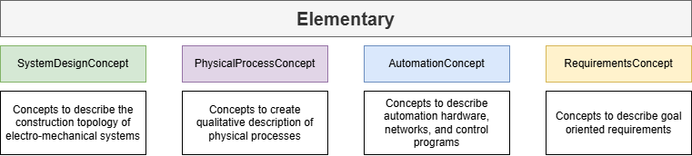

The four parts inter-link to form the _holistic knowledge_ of the system (oh, how I detest myself for using the word _holistic_). 
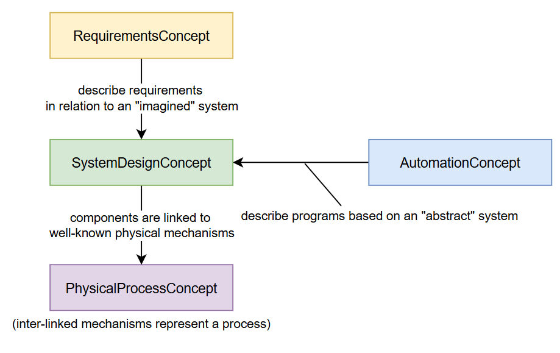{width=40%}

First, I think it will be easier if I tell you that there are actually _three conceptions of systems_ involved (of which only one is real): (1) the system as conceived by the requirements engineer ("the comfort conditions in the building shall be maintained by an air-condition system which.."), (2) the system that is actually built (and hopefully it _resembles_ the conceived system), and (3) an abstract notion of system against which a standard control logic (for a library) is created ("this program is intended to control the air flow through a fan coil unit"). The automation engineer tries to match / customize (3) against (2) in the background of (1), or might need to create a new program that is suitable for (2) in the background of (3).

For those who like to think in terms of _personas_, think about (1) as requirements engineer, (2) as system designer/constructor, and (3) the automation programmer (we know _this_ person well)

This picture might be easier to digest. Please spend few minutes here:

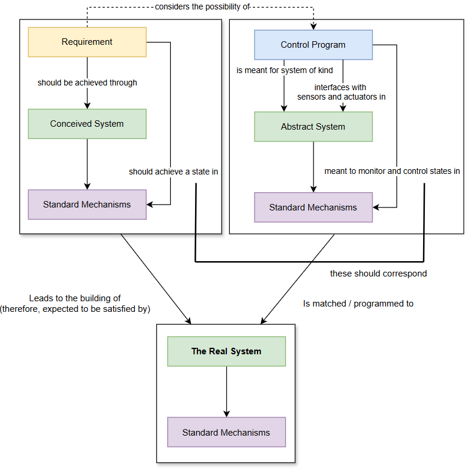{width=40%}

It is important to note that the requirements engineer has also an intuition about how a system could potentially be controlled (doesnt specify exactly how, but does know, for example, that the light level in a room can be controlled on the basis of a light sensor). The matching of a standard control program, or creation of a new one, involves matching the _abstract system_ to the _real system_ while making sure that the required behaviour is covered.

Semantic modeling in classical engineering industrial domains has been more or less focussed around describing only the system design part. This is only a _part_ of the required knowledge. In the following sections I will explain more in detail as to why we need a much more comprehensive inter-connected knowledge of the system that also inlcudes requirements (why was it built in the first place), its automation (how are the components controlled), and (at least) some idea of the underlying physical principles (why it does what it does).

Since inter-linking is such an important need, other than providing a vocabulary for expressing the four principal aspects, Elementary also provides concepts to inter-link them:

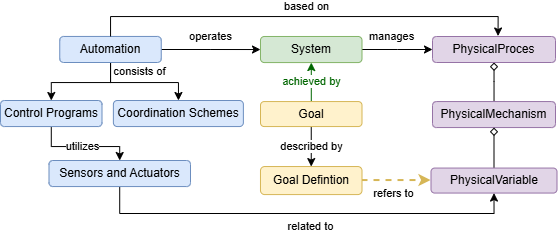

By inter-linking the individual concepts, we allow a system designer to express **how** a system is constructed, **what** is does **physically**, how is this related to the requirements, and finally, the role of the automation system in achieving the goals.

### Do you need to read everything in this document?
I have sectioned this document according to the four elementary aspects. You can jump to any of them and they shold make sense standalone. Within a section, the first part is general - this should give you a good idea about why and how the concepts have been designed the way they are. Then I dive in to details with example RDF and SPARQL queries. You can skip this if you dont want to know the nuts and bolts. 

I suck at writing good text. But I think I am cereberally compensated by the visual cortex, so you will see a lot of diagrams. I know that is not formal and all, but what the heck, you will get the whole load of formality in the ontology.

## How would description of System Design look like?

Elementary provides the core concepts to describe what you are dealing with (i.e., the electro-mechanical system, its requirements, and therefore, the automation needs). The concepts are equally well applicable to both simple and complex systems. 

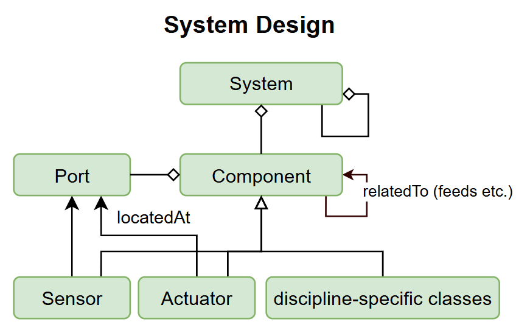{width=30%}

Let us consider a real-life system with medium complexity. The figure below is the schematic of a system called the Air Handling Unit (bear with me on this).
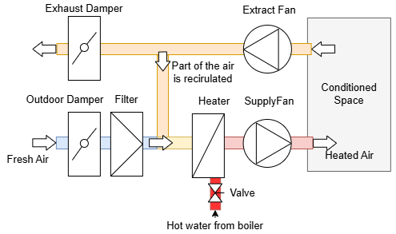

Here is a quite good AI-generated description of the figure above:
This Air Handling Unit (AHU) conditions and circulates air through a building by mixing fresh outdoor air with recirculated indoor air. 

1. Air Intake and Mixing

* **Fresh Air Intake**: Outdoor air enters the system through an **Outdoor Damper**, which regulates the volume of incoming air.
* **Air Filtration**: This fresh air passes through a **Filter** to remove dust, debris, and airborne particles.
* **Recirculation**: An **Extract Fan** pulls stale air out of the **Conditioned Space**. A portion of this air is released outside via the **Exhaust Damper**, while the rest is directed downward to mix with the filtered fresh air.

2. Heating and Conditioning

* **Thermal Exchange**: The mixed air passes through a **Heater** (heating coil). 
* **Temperature Control**: A **Valve** modulates the flow of hot water from a boiler into the heater to control how much heat is transferred to the air stream.

3. Supply and Distribution
* **Air Delivery**: The **Supply Fan** draws the heated air from the coil and pushes it forward.
* **Space Heating**: This conditioned, **Heated Air** is delivered directly into 

The topology of this system can be expressed using the Semantic Web language. Here is the description in RDF-Turtle syntax. Do glance through it. Especially to see how it make the knowledge machine-understandable.

```turtle
@prefix rdf:   <http://w3.org> .
@prefix rdfs:  <http://w3.org> .
@prefix brick: <https://brickschema.org> . # Consider this as the HVAC ontology
@prefix ex:    <http://example.org> .
@prefix elem: <http://w3id.org/elementary#>

### --- System & Location Composition ---

ex:Main_AHU a brick:Air_Handling_Unit, elem:System ;
    rdfs:label "Air Handling Unit" ;
    brick:feeds ex:Office_Zone .

ex:Office_Zone a brick:HVAC_Zone ;
    rdfs:label "Conditioned Space" .


### --- Equipment Components ---

# Dampers
ex:Outdoor_Damper a brick:Outdoor_Damper, elem:Component ;
    rdfs:label "Outdoor Air Damper" ;
    brick:isPartOf ex:Main_AHU .

ex:Exhaust_Damper a brick:Exhaust_Damper, elem:Component ;
    rdfs:label "Exhaust Air Damper" ;
    brick:isPartOf ex:Main_AHU .

# Filter
ex:Air_Filter a brick:Air_Filter, elem:Component ;
    rdfs:label "Fresh Air Filter" ;
    brick:isPartOf ex:Main_AHU .

# Fans
ex:Extract_Fan a brick:Return_Fan, elem:Component ;
    rdfs:label "Extract Air Fan" ;
    brick:isPartOf ex:Main_AHU .

ex:Supply_Fan a brick:Supply_Fan, elem:Component ;
    rdfs:label "Supply Air Fan" ;
    brick:isPartOf ex:Main_AHU .

# Heating Components
ex:Heating_Coil a brick:Heating_Coil, elem:Component ;
    rdfs:label "Hot Water Heating Coil" ;
    brick:isPartOf ex:Main_AHU .

ex:Hot_Water_Valve a brick:Hot_Water_Valve, elem:Component ;
    rdfs:label "Hot Water Control Valve" ;
    brick:controls ex:Heating_Coil .


### --- Airflow and Fluid Topologies ---

# Outside Air Intake and Filtration Path
ex:Outdoor_Damper elem:feeds ex:Air_Filter .
ex:Air_Filter     elem:feeds ex:Heating_Coil .

# Extract and Recirculation Loop
ex:Office_Zone   elem:feeds ex:Extract_Fan .
ex:Extract_Fan   elem:feeds ex:Exhaust_Damper , ex:Heating_Coil . # Split path to exhaust and mixing point

# Supply Path
ex:Heating_Coil  elem:feeds ex:Supply_Fan .
ex:Supply_Fan    elem:feeds ex:Office_Zone .
```

The nice thing about a Knowledge Graph based on a formal ontology is that it can be queried using a structured language. This is what a SPARQL query for listing out all kind of fans and things they feed into looks like:

```sparql
PREFIX rdfs:  <http://w3.org>
PREFIX brick: <https://brickschema.org>

SELECT ?fanName ?fanTypeLabel ?destinationName ?destinationTypeLabel
WHERE {
  # Find any equipment that is a subclass of brick:Fan (captures both Supply and Return fans)
  ?fan a ?fanType .
  ?fanType rdfs:subClassOf* brick:Fan .
  
  # Trace the downstream path where the fan feeds air to another asset or zone
  ?fan brick:feedsAir ?destination .
  ?destination a ?destinationType .
  
  # Fetch human-readable labels for cleaner output
  ?fan rdfs:label ?fanName .
  ?destination rdfs:label ?destinationName .
  
  # Optional: Fetch readable names of the specific Brick classes
  OPTIONAL { ?fanType rdfs:label ?fanTypeLabel }
  OPTIONAL { ?destinationType rdfs:label ?destinationTypeLabel }
}
ORDER BY ?fanName
```

This is really nice, right? You have a knowledge modeled in formal model against which you can throw semantic queries. But we want more. For example, how do we know which components are actively responsible for achieving heating in the conditioned space? What role does the exhaust air damper plays on the air pressure in the space? Under a given state of the system, what will happen when the supply fan speed is increased? What is the best way to improve the air quality while not compromising energy consumption? 

#### An Interlude: what about LLMs?

Not surprisingly, once we have a validated topological description like the above one, the ever-improving LLMs are impressive in answering such questions. But the well-known trouble is that they are not reliable. Unless of course they have seen each possible combination of configuration and possible states - something which we cant expect to happen unless the system descriptions, run time data, and the underlying physical principles are made available to the LLMs. Moreover, notice that some expert had to validate the above topology description. Though we reduced the required manual engineering, we did not achieve autonomy.

I know that at this point it is **not** conclusive that LLMs on their own cannot do the job. I doubt I would be able to or want to conclude that way. Instead, I would like to show that with rather low effort, we can massively help LLMs and benefit in the larger context. We will come to Graph RAGs later in the Outlook section.

### System design sounds ok, but why do we need the other parts?

The thought is not surprising and even a fair one. We humans are usually good at figuring out how things work. In most cases just high school science is sufficient. I often use the example of an electric water kettle in my lectures to show how intuitive our reasoning is. But still, quite a few miss out that the kettle's behaviour would be different high up in the mountains. Or would have to learn through observation about how long it takes to boil a liter of water. Or learn through experience what a (particular) kettle does after the water has started boiling? (oh, I have a fancy kettle that keeps the water at 80C for next 1 hour -- discovered that). But you see the point I am trying to make? It is common sense knowledge **plus** experience that makes you aware of how things work (i.e., if you dont read the manuals, which may not have everything, like how long it will take to boil the water).

Kettles apart, when it comes to industrial systems, the sizes and complexities blows up the problem. How does the building's heating/cooling system work? Why does the heating not work when the outdoor temperature is greater than 15C? Was it in the requirements or regulations? Is it working efficiently? Whats wrong with it?

I think it will be easier if I tell you how, other than system design, you can also model requirements, automation, and physics, and interlink the descriptions. Then it will be rather easy to see what it can it do. Either on its own, or when coupled with AI methods.

## Requirements : How can we describe requirements in a _machine understandable_ manner?

This a can of worms. Mostly because requirements are imprecise and incomplete to begin with and are only alright after the system has been built, operated, and ready to be decomissioned. I am talking of requirements for electro-mechanical systems. So, software engineers, remember the virtual world is **much** more controlled. But my view is a bit too sweeping -- there are domains where requirements are ultra precise. Just take aeronautical or medical domain as an example. Life safety seems to be the driver. They even have arcane formal verifications in place. But thats the Mercedes Benz end of the spectrum. For systems like the one for heating in your building, or the air handling unit in our example, you would be lucky to find any sort of requirement. My approach is: have an ontology to describe requirements and then then have AI agents interpret, question the source, and then synthesise the formal model. More on this a bit later, but first the model.

### Goal-oriented Requirements Engineering

The concept of goal-oriented requirements engineering (GORE) has been around for long. What it proposes is that each requirement be related to the performing system/component and the statement about the _physical_ variables that should be achieved, maintained, or avoided. It does not specify how the automation should act, just what should be accomplished. The part related to physical variables is of importance. GORE provides a grammar to express, dependencies, pre-, and post-conditions of achieving a goal. Not just static, but statement based on temporal logic can be included ("within one hour of starting the pump, the pressure should reach at least 80% of the designed value"). The work of Lamsweerde, who I believe is the fountainhead, is a pleasure to read. Though the formalization and grammar proposed by him is quite extensive, there was never really a progress towards defining a _language_ and a _representation format_. As a result GORE served merely as citation for research work that claim to rein in the wild west of requirements. Here is a picture of GORE in a nutshell:
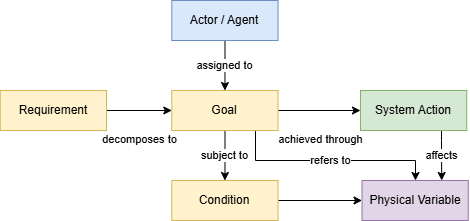

But now, what if we create a Semantic Web ontology for GORE (i.e, give it both formalization and language) and then let a good LLMs chew human-created requirements and generate the knowledge graph? Would it work? Well I am not the first to attempt the ontology part, aparently there ought to be several ontologies out there like GORO etc. But try locating them. And one more thing, the papers that describe the proposed ontologies actually do not consider integrating system design! I am mean, when you describe what you want your air handling unit to do, you refer to components in the system dont you? Like, "when the outdoor temperature is less than freezing point, ensure that the heating coil is not frosted". So, here is my retake on the GORE ontology (it is part of Elementary, classed under ````RequirementsConcept```` just in case you want to go and browse the ontology right away):

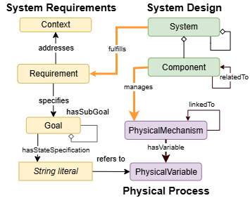

If you are, like me, too lazy to load the ontology in [Protege](https://protege.stanford.edu/) and browse, here is a screenshot:
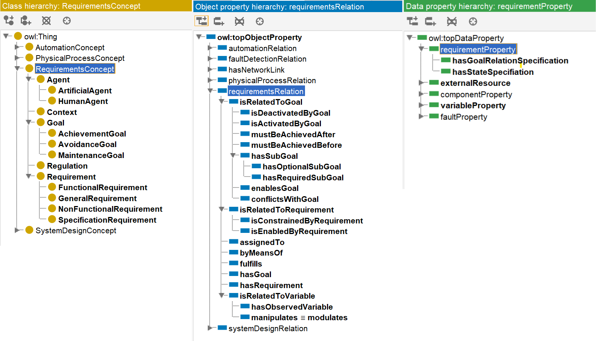

### Requirements Specification

I think the _structural_ part related to describing the requirements, goals, and their inter-relationships are not hard to understand. But what is crucial for our vision of achieving autonomous systems is the _goal specification_ part. That is, how do we formally specify a goal in terms of the physical variables and state of the components? This is a rabbit hole and we dont have Alice kinds in engineering. There are tons of standards that address this need: Signal Temporal Language (STL), Temporal Logic of Actions (TLA), Metric Temporal Language (MTL), Timed Computation Tree Logic, KAOS Assertion Language, etc. Each of these have at least something very interesting and unique which will further out objective. But the question is: what kind of tooling is required to integrate their use in to existing engineering practices? We know that most of our requirements are text, and in some cases, augmented with semi-formal diagrams like UML. So, things like STL, TLA, et al are nice, but we hit a roadblock because requirements engineering tools used in practice dont care about formal representation and standard grammar.

#### Ok, _now_ we let loose the LLMs

Trying to extract and model goal specifications seemed like a dead end, until quite recently when I realized how good LLMs are getting at reasoning about requirements text. Not surprsing because requirements texts are quite close to be being _controlled natural language_ ([the work](https://attempto.ifi.uzh.ch/site/pubs/papers/doctoral_thesis_kuhn.pdf) by Tobias Kuhn is worth reading). I think this makes it super nice for the attention layers. I took a set of real-life requirements (120 of them of different qualities) and ran them through GPT5.2 and asked it to first translate them to CNL and then after manual inspection of each of STL, TLA, and MLA found that it work _well_ (the stuff that did not work as expected were anyway ambigous in the sourc text). I mean, it just worked in a practical sense! The LLM even indicated incomplete and ambiguous input. Take for example:

> Consider this requirement created by human expert. Translate this to controlled natural language: "The air handling unit should respond to changing air demands by considering a combination of signals from the supply pressure sensor and the air flow demand from the VAVs. The AHU should maintain a minimum supply pressure even if VAV demand is low. If the VAV demand goes to zero, then the AHU should go in economy mode"

The proposal for CNL is:

Controlled Natural Language (CNL)
* **Always**, the Air Handling Unit shall calculate its target output based on the supply pressure sensor signal and the VAV air flow demand signal.*
* **Always**, the Air Handling Unit shall maintain the supply pressure at or above the minimum supply pressure threshold.*
* **If** the VAV air flow demand signal is equal to zero, **then** the Air Handling Unit shall enter economy mode **within** \(T\) time units.*


For STL it proposed:

We define the following continuous signals and constants:
\(P_{sup}(t)\): Supply pressure sensor signal at time \(t\)\(D_{vav}(t)\): 
Total VAV air flow demand signal at time \(t\)\(M_{eco}(t)\): 
Binary indicator for economy mode (\(1\) if active, \(0\) otherwise)\(P_{min}\): 
Constant value for the minimum allowable supply pressure
Here are the formal STL formulas:

1. Minimum Pressure Maintenance The system must guarantee that the supply pressure never drops below the minimum safety threshold, regardless of demand.\(\Box \,(P_{sup}(t)\ge P_{min})\)

2. Economy Mode ActivationIf the VAV demand drops to zero, the system must switch to economy mode within a maximum time delay of \(\tau \).\(\Box \,\left((D_{vav}(t)==0)\implies \diamonds _{[0,\tau ]}\,(M_{eco}(t)==1)\right)\)

Additionally, and rightfully, GPT5.2 points out:
>What is the acceptable reaction time delay (\(\tau \)) for entering economy mode? Do you have a specific mathematical function (\(f\)) that combines the sensor signals?

It also outputs the list of variables that I need to bind:

> Supply Air Pressure: Measurable pressure signal from the duct sensor. Airflow Demand: Combined flow request signal from the VAV boxes. Minimum Supply Pressure: Lowest allowable pressure limit for the system. Zero Demand State: Condition where VAV airflow requests equal zero. Active Demand State: Condition where VAV airflow requests exceed zero. Economy Mode: Low-energy operational state of the AHU.

We can now visualize how a model based on GORE would like in the knowledge graph:

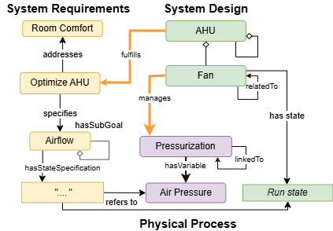

```sparql
@prefix elem: <http://w3id.org/elementary#> .
@prefix ex:  <http://example.org> .
@prefix rdfs: <http://w3.org> .
@prefix xsd:  <http://w3.org> .

### 1. SYSTEM REQUIREMENTS INSTANCES ###

ex:AirConditionedSpace a elem:Context ;
    rdfs:label "Room Comfort" .

ex:OptimizeAHU a elem:Requirement ;
    rdfs:label "Optimize AHU" ;
    elem:addresses ex:AirConditionedSpace ;
    elem:specifies ex:AirflowGoal .

ex:AirflowGoal a elem:Goal ;
    rdfs:label "Airflow" ;
    elem:hasStateSpecification ex:AirflowStringLiteral .

# Represents the literal block linking text, variable, and state
ex:AirflowStringLiteral a elem:StringLiteral ;
    rdfs:label "..." ; 
    elem:refersTo ex:AirPressureVar ;
    elem:physicalProcess ex:RunState .


### 2. SYSTEM DESIGN INSTANCES ###
ex:AHU_System a elem:System ;
    rdfs:label "AHU" ;
    elem:fulfills ex:OptimizeAHU ;
    elem:hasComponent ex:FanComponent .

ex:FanComponent a elem:Component ;
    rdfs:label "Fan" ;
    elem:manages ex:PressurizationMech .


### 3. PHYSICAL MECHANISM & PROCESS INSTANCES ###
ex:PressurizationMech a elem:PhysicalMechanism ;
    rdfs:label "Pressurization" ;
    elem:hasVariable ex:AirPressureVar .

ex:AirPressureVar a elem:PhysicalVariable ;
    rdfs:label "Air Pressure" .
```

So, given an _integrated_ knowledge graph like the one above, it is now easy to logically reason which requirements affect a physical variable, and how the system delegated to fulfill the requirement can potentially achieve the goal. The last part, i.e., how the goal could potentially be achieved, needs reasoning about how the physical mechanism works. Thats where we head to next.

## Physical Mechanism: How do we capture common sense physics behind components and systems?

With mathematical equations, of course. That would be certainly provide much more beyond _common sense_. A mathematical model that represents the near exact functioning of a partcular component would however need parameterization (to capture the components sizing and dynamics). This is more often than not an extensive work. But, for many cases, especially those where only need causal graphs with perhaps a bit of idea on dynamics, we could do with a much more generic or qualitative model of physics. I came up with two ways to do this: (1) describe the physical mechanism in terms of variables and their dependency, and/or (2) create functional mockup unit of simulation of generic components and describe its interfaces. The latter can capture general dynamic responses. The former can be encoded in to the knowledge graph and does not require any execution engine or solver. Let me briefly describe these two things.

### Qualitative Model of Physical Processes and Mechanisms
Lets resort to visuals again. The key concepts required to describe physics underlying a electro-mechanical component are:
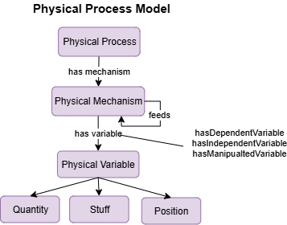

There is already some semantics captured by the _has variable_ relationship. Independent variables are those that influence the outcome of the mechanism. Manipulated variable is a specific kind that can be externally manipulated. The outcome is reflected by the change of the dependent variable. Mechanisms can be linked with one another such that "stuff" (a nice term that covers substance, energy, and force) flows between them.

Applying these concepts to a simple process where oil is fired up to heat water in pipes of boiler, the graph would look like:
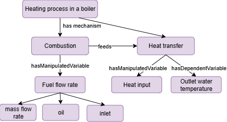

Elementary also allows conditions for the mechanism to be expressed. For example:
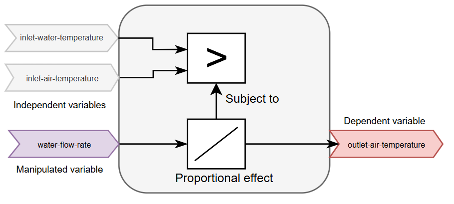{width=40%}

So far, we have discussed only the physics part. The qualitative model can be "linked" to the structural model by linking the variables to the physical ports where they can be observed or manipulated. Again, example:
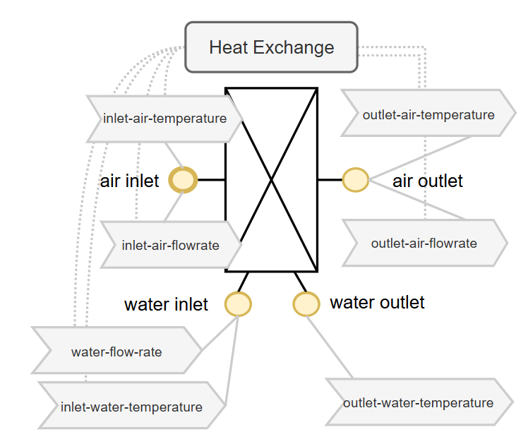{width=20%}

Once you have a component and its underlying physics, you can reason about interaction between connected components by chaining the dependent and independent variables dealing with same stuff. For example:

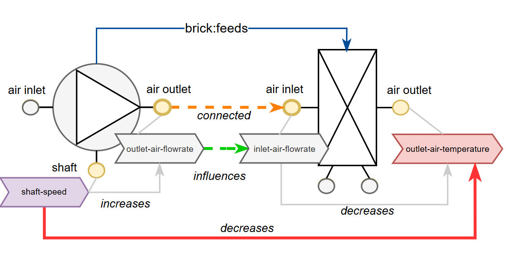{width=40%}

This is actually pretty useful. Given a knowledge graph that describes the topology of a complex electro-mechanical system, you can examine the inter-connections and know what is happening. I built a little tool to visualize this. In the screenshot below, I am examining the process relation between a motor and a fan it drives (I know, this is terribly simple, but trying to work your way through a complex example is not what you want):
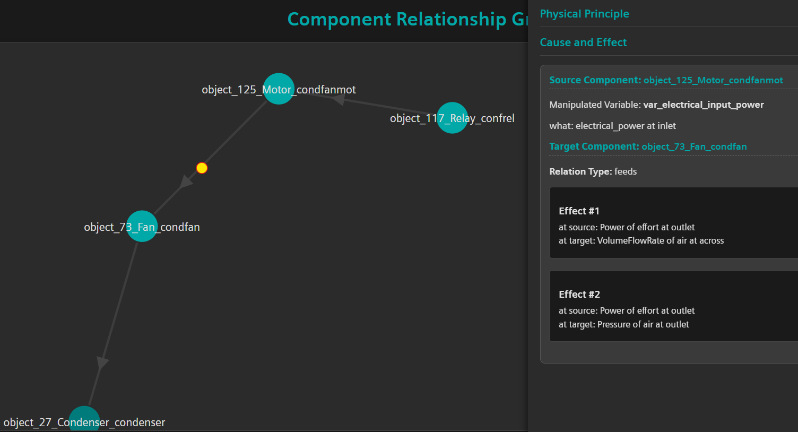{width=40%}
On the right pane you see the automated inference which says that if you increase the electrical power input to the motor it will result in change in air flow rate and pressure.

All this is very generic. You take the knowledge graph of the system, take a library of stereotypes, and viola: you have the ability to reason about the physical processes. For those who think that this must involve horrific inference rules, relax. The knowledge graph query is nothing more than:

```sparql
PREFIX elem: <http://www.w3id.org/elementary#>
select * where {
    #What is the process relation between two components c1 and c2?
    ?c1 elem:hasStereotype ?s1. ?c2 elem:hasStereotype ?s2.
    {?c1 elem:feeds ?c2} UNION {!c1 elem:hasUpstreamEffectOn ?c2}.
    ?s1 elem:hasPhysicalMechanism ?pm1. ?s2 elem:hasPhysicalMechanism ?pm2.
    ?pm1 elem:hasDependentVariable ?s1dv.
    ?pm2 elem:hasIndependentVariable ?s2iv.
    ?s1dv elem:dealsWithStuff ?common_s.
    ?s1dv elem:hasQuantity ?common_q.
    ?s2iv elem:dealsWithStuff ?common_s.
    ?s2iv elem:hasQuantity ?common_q
}
```

At this point, you might have a nagging thought: do you need to do this for every component instance in your system? Well, not, and thats the beauty of the approach. You can describe a _stereotypical_ component using the concepts in Elementary. In fact, physical mechanisms are even more generic -- a mechanism can be used by muliple component types. The _stereotypical_ component can be stored in a library and then every real component of that class can be _automatically_ associated to the stereotpye. One such library that I created is for heating, ventilation, and air-conditioning components. 

### Reduced Order Model of Physical Processes and Mechanisms

It is nice that you can get causal graphs. But we all know that is only a model of static behaviour. We could do dynamics if we can nicely encode (and solve) differential equations in RDF. I will leave that as an exercise to a proper nerd. Let me take to you a rather cheap solution. You can do all that maths nicely in a software program. Thats called a simulation model. You can make the simulation model portable by generating what is called as a _Functional Mockup Unit_ (FMU).

Here is a FMU written in Python (the compiled FMU can be loaded and run in any FMI compliant host):

_Note:_ I find the class name ``Fmi2Slave`` very parochial and insensitive. The community behind pythonfmu recognized this but chose to keep it so that it is consistent with the legacy FMI2.0 specification.

```python
from pythonfmu import Fmi2Slave, Fmi2Causality, Fmi2Variability, Real

class GenericFan(Fmi2Slave):

    def __init__(self, **kwargs):
        super().__init__(**kwargs)
        
        # --- PARAMETERS (Fixed during simulation) ---
        self.max_flow_m3s = 5.0      # Maximum volumetric flow rate (m³/s)
        self.max_power_w = 1200.0    # Peak power consumption at max flow (W)
        self.air_density = 1.2       # Air density (kg/m³)
        self.fan_efficiency = 0.65   # Combined fan and motor efficiency (0-1)

        # Register Parameters
        self.register_variable(Real("max_flow_m3s", causality=Fmi2Causality.parameter, variability=Fmi2Variability.tunable))
        self.register_variable(Real("max_power_w", causality=Fmi2Causality.parameter, variability=Fmi2Variability.tunable))
        self.register_variable(Real("air_density", causality=Fmi2Causality.parameter, variability=Fmi2Variability.tunable))
        self.register_variable(Real("fan_efficiency", causality=Fmi2Causality.parameter, variability=Fmi2Variability.tunable))

        # --- INPUTS (Provided by external environment) ---
        self.control_signal = 0.0    # Control signal bounded between 0.0 and 1.0
        self.mass_flow_in = 0.0      # Incoming air mass flow rate from system (kg/s)

        # Register Inputs
        self.register_variable(Real("control_signal", causality=Fmi2Causality.input))
        self.register_variable(Real("mass_flow_in", causality=Fmi2Causality.input))

        # --- OUTPUTS (Calculated by the FMU) ---
        self.volumetric_flow = 0.0   # Current volume flow (m³/s)
        self.power_consumption = 0.0 # Electrical power draw (W)
        self.pressure_rise = 0.0     # Pressure difference generated by fan (Pa)

        # Register Outputs
        self.register_variable(Real("volumetric_flow", causality=Fmi2Causality.output))
        self.register_variable(Real("power_consumption", causality=Fmi2Causality.output))
        self.register_variable(Real("pressure_rise", causality=Fmi2Causality.output))

    def do_step(self, current_time: float, step_size: float) -> bool:
        # 1. Enforce control signal physical boundaries
        ctrl = max(0.0, min(1.0, self.control_signal))
        
        # 2. Calculate Volumetric Flow Rate based on control setting
        self.volumetric_flow = ctrl * self.max_flow_m3s
        
        # 3. Calculate Power Consumption (cubically scales with control/speed)
        self.power_consumption = (ctrl ** 3) * self.max_power_w
        
        # 4. Calculate Pressure Rise (P = (Power * Efficiency) / Volumetric Flow)
        # Avoid division by zero when the fan is completely off
        if self.volumetric_flow > 0.001:
            useful_fluid_power = self.power_consumption * self.fan_efficiency
            self.pressure_rise = useful_fluid_power / self.volumetric_flow
        else:
            self.pressure_rise = 0.0
            
        return True

```
Such a code can be compiled and distributed. It can be consumed by clients on different platforms. Example:
```python
from fmpy import simulate_fmu, dump

# Print metadata structure contained in the FMU
dump('GenericFan.fmu')

# Run a quick 10-second simulation loop with a fixed 50% fan speed control input
result = simulate_fmu(
    'GenericFan.fmu',
    stop_time=10.0,
    step_size=1.0,
    input_data={'control_signal': (0.5)}
)

# Display the performance outputs at the final simulated time step
print(f"Time: {result[-1]['time']}s")
print(f"Volumetric Flow: {result[-1]['volumetric_flow']} m3/s")
print(f"Power Draw: {result[-1]['power_consumption']} W")
print(f"Pressure Rise: {result[-1]['pressure_rise']} Pa")


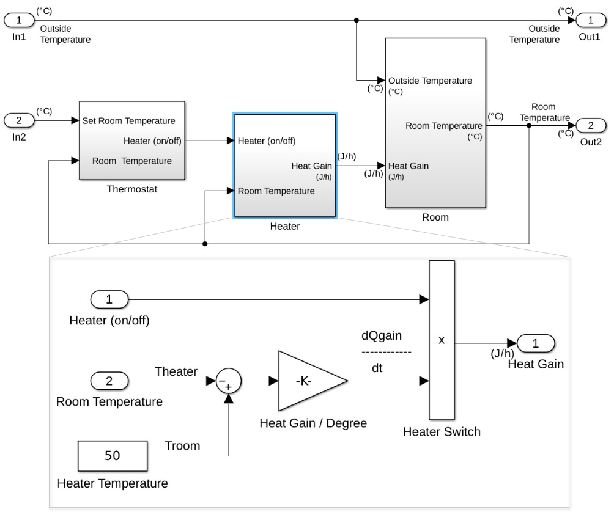

```

An FMU can be described using the FMUOntology. Here is an RDF snippet for our ``GenericFan``:

```turtle
### --- FMU MODEL CLASS DECLARATION ---
ex:FanModel a fmuo:FMUModel ;
    rdfs:label "Fan Simulation Model" ;
    fmuo:hasVariable 
        ex:max_flow_m3s, ex:max_power_w, ex:air_density, ex:fan_efficiency,
        ex:control_signal, ex:mass_flow_in,
        ex:volumetric_flow, ex:power_consumption, ex:pressure_rise .


### --- PARAMETERS (Tunable Parameters) ---
ex:max_flow_m3s a fmuo:Variable ;
    rdfs:label "max_flow_m3s" ;
    rdfs:comment "Maximum volumetric flow rate" ;
    fmuo:hasCausality fmi:parameter ;
    fmuo:hasVariability fmi:tunable ;
    fmuo:hasDataType xsd:double ;
    fmuo:hasUnit "m3/s" ;
    fmuo:hasValue 5.0 .
```

If we take half a step back, we can see that an FMU is a sort of a stereotypical description of the mechanism. And we can see that it has the interface variables with semantics same as a physical mechanism. With an ontology-based description, one can easily match an FMU in a libary to physical mechanism at hand.

The value of having even a partially accurate simulation model is that one can check if the _trajectory_ of a control program is right before trying it on the physical system:

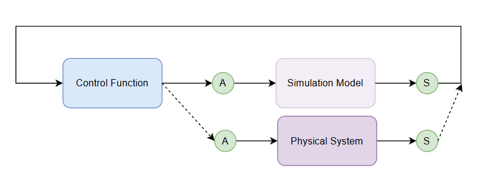

### Who creates these models of commond physical processes?


### How can the model of physical process be integrated to system design?

Now that you can have an integrated model of the structure _and_ behavior of your system, can we use this to describe what the automation programmer had in mind?

## Automation: How can we describe standard control and coordination strategies?

Just to remind you of the background to this part: we dont want to rely on generative AI to create the control program for a given scenario (i.e., the requirements and the system built for the purpose). Generative AI does work _decently good_ for things like room thermostat, but begins to waver once you have inter-connected sub-systems that may need to coordinate too. Unlike regular software vibe coding, you really dont have much chance of refining the code in iterations -- you wouldnt dare to deploy the first code suggestion on the real machine (and you wouldnt have or trust a simulator).

That said, over the past decades control application engineers have developed tons of standard control strategies and tested them out. Such standard strategies are sort of patterns that can be applied with slight reconfiguration and parametrization to suit an actual instance of the electro-mechanical system. For example, there are standard _function blocks_ for motion control applications. So if I have a conveyor belt to control, I would just pick a standard block from a library (like [this](https://autonomylogic.com/) one). But _how_ would I decide to pick one of these? I would look at the description of the block (its control algorithm) and its interfaces and match to the conveyor sub-system that I have. If only this process were also machine-understandable, we could have intelligent artificial agents doing the same. Right now, such _function blocks_ have the regular documentation for human experts. Not bad for LLMs, but then there is the question what _facts_ are used for reasoning about the match of a _function block_ to a given sub-system. A machine-understandable description based on logical formalization would make things both deterministic and explainable.

So, here is the idea: designers of standard control programs would describe their program in the context of an _abstract system_ they have in mind. This description would be based on a formal language, and this is what is supported by the ontological concepts in Elementary. Now, given such a semantic description, we can match the control program to an actual _instance_ of a system. In other words, it matching based on semantic rules.

I think I need to use the explain-by-example method. Suppose that a control program designer is creating a control logic for combustion control of generic boilers. He or she would have something like this in mind:
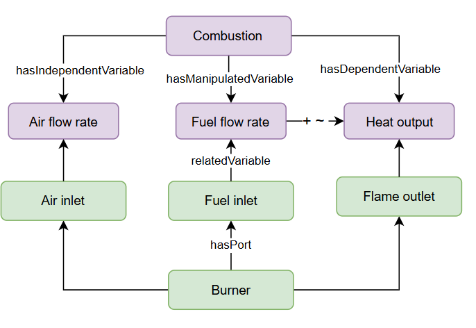

Such diagrams may also include causal relationships (the + ~ in the above diagram is a notation to indicate positive non-linear influence). Elementary enables us to model such knowledge. Describing the _abstract system_ is a one-time activity. Now, to link the descritpion of the control program to the abstract system, the program designer does two thing: (1) declares the goal in terms of the _physical variables_ associated with the abstract systems, and (2) asserts the relationship of the inputs and outputs of the programs to sensors and actuators respectively. Lets look at this diagrammatically:

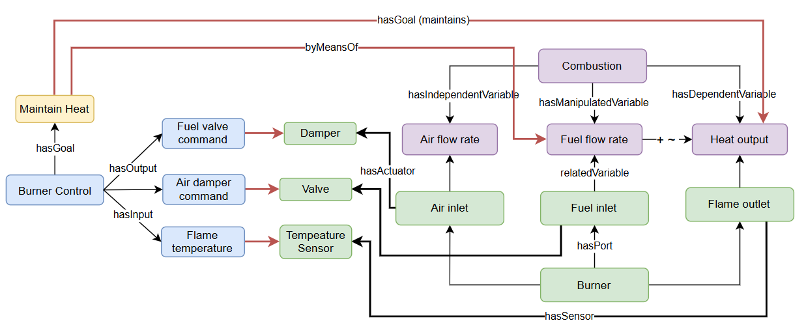

What do we get out of this? First, there is a better machine-understandable explanation of the what the program does (perhaps even a better human-understandable explanation). Second, if you have a system at hand which _in principle_ is same as the abstract system, then you can reason about the match of the control program. Say, you have a boiler burner with variable speed fuel pump instead of a valve for controlling the amount of fuel feed. You can still use the program because its intention is to control the fuel feed rate and therefore it does not matter if that is via a modulating valve or a pump. In other words, we are matching based on the physical principle managed by the sub-system and the physical role of the sensors and actuators attached to it.

```turtle
@prefix ex:   <http://example.org/burner-control-kg#> .
@prefix elem: <http://w3id.org/elementary#> .
@prefix rdf:  <http://www.w3.org/1999/02/22-rdf-syntax-ns#> .
@prefix rdfs: <http://www.w3.org/2000/01/rdf-schema#> .

# System/controller/goal
ex:BurnerControl a elem:ControlProgram ;
  rdfs:label "Burner Control" ;
  elem:hasGoal ex:MaintainHeat ;
  elem:hasOutput ex:FuelValveCommand, ex:AirDamperCommand ;
  elem:hasInput ex:FlameTemperature .

ex:MaintainHeat a elem:Goal ;
  elem:affectedVariable ex:HeatOutput;
  elem:goalSpecification "Maintain heat output of the combustion";
  ex:byMeansOf ex:Combustion .

ex:FuelValveCommand a elem:Output ;
  elem:modulates ex:FuelValve .

ex:AirDamperCommand a elem:Output ;
  elem:modulates ex:AirDamper .

# Sensor and measured variable
ex:TemperatureSensor a elem:Sensor ;
  elem:hasQuantity qudt:Temperature;
  elem:dealsWithStuff elem:gas;
  elem:measures ex:FlameTemperature .

ex:FlameTemperature a elem:PhysicalVariable ;
  elem:hasQuantity qudt:Temperature;
  elem:dealsWithStuff elem:gas;
  elem:hasProcessPosition elem:outlet.

ex:Damper a hvac:DamperActuator .

ex:Valve a hvac:Valve ;

# Process: Combustion and its variables
hvac:stype_combustion a elem:PhysicalProcess ;
  elem:hasIndependentVariable ex:AirFlowRate ;
  elem:hasManipulatedVariable ex:FuelFlowRate ;
  elem:hasDependentVariable ex:HeatOutput .

ex:AirFlowRate a elem:PhysicalVariable ;
  elem:hasQuantity qudt:VolumetricFlowRate;
  elem:dealsWithStuff elem:air;
  elem:hasProcessPosition elem:inlet.

ex:FuelFlowRate a elem:PhysicalVariable ;
  elem:hasQuantity qudt:VolumetricFlowRate;
  elem:dealsWithStuff elem:oil;
  elem:hasProcessPosition elem:inlet.

ex:HeatOutput a elem:PhysicalVariable ;
  elem:hasQuantity qudt:Enthalpy;
  elem:dealsWithStuff elem:gas;
  elem:hasProcessPosition elem:outlet.

# Physical components / ports
ex:Burner a elem:Component, hvac:Burner ;
  elem:hasPort ex:AirInlet, ex:FuelInlet, ex:FlameOutlet .

ex:AirInlet a elem:InletConnectionPort ;
  elem:hasActuator ex:Damper .

ex:FuelInlet a ex:InletConnectionPort ;
  ex:hasActuator ex:Valve .

ex:FlameOutlet a elem:OutletConnectionPort ;
  ex:relatedVariable ex:HeatOutput .
```

## Integration in engineering and operation workflows

Lets try to tie things together _practically_ now. So far I have put forward how requirements, system design, physical processes, and automation can be modeled using Semantic Web ontologies. You also saw how they can be interlinked: requirements refer to the _intended_ system and the _general_ physical process it manages, concrete system description is linked to more _precise_ physical process model, and description of automation programs, like requirements, are linked to the _abstract_ system and its processes. How would this work in engineering practice?

### Generating knowledge graph from text and diagrams in system specification

### Generating semantic descriptions of standard automation programs

### Discovering datapoint objects and linking them to system description

### Using the knowledge graph to find matching automation program for a given system (or sub-system)

### Explaining the possible causation of an alarm event

### Explaining / detecting anomalies in timeseries data

## Outlook
